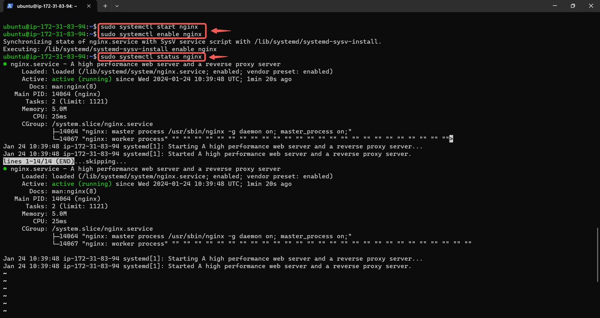
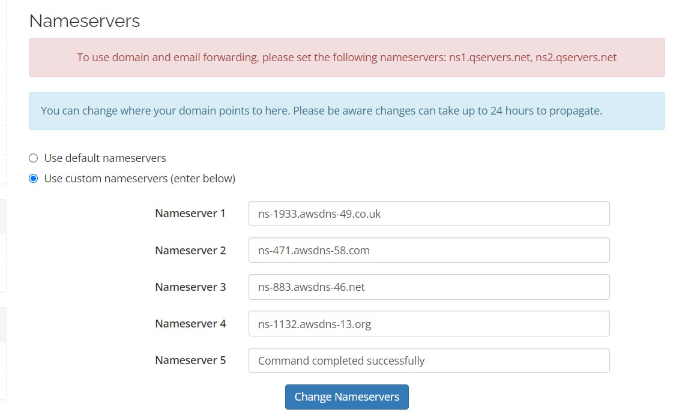

 # **Website Hosting Project Documentation**

## **Introduction**

### **Project Overview**
This project documents the process of hosting a website using AWS EC2, Ubuntu, Nginx, and Certbot for SSL certification. The goal of this project was to set up a robust and secure web server environment for deploying a static or dynamic website.

### **Technologies Used**
- **AWS EC2**: Provides the server infrastructure.
- **Ubuntu**: The operating system running on the EC2 instance.
- **Nginx**: Web server to serve the website.
- **Certbot**: Tool to obtain and manage SSL certificates.
- **Namecheap/Qservers**: Domain registrar and DNS management.

## **Setup and Configuration**

### **1. AWS EC2 Instance Setup**

#### **Step 1: Launch an EC2 Instance**
- Log in to the AWS Management Console.
- Navigate to the EC2 Dashboard and click on **Launch Instance**.
- Select **Ubuntu Server 20.04 LTS** as the AMI (Amazon Machine Image).
- Choose an instance type, e.g., **t2.micro**.
- Configure instance details, such as network and storage settings, if needed.
- Review and launch the instance. During launch, create or select an existing key pair for SSH access.


#### **Step 2: Allocate and Associate an Elastic IP**
- In the EC2 Dashboard, go to **Network & Security > Elastic IPs**.
- Allocate a new Elastic IP and associate it with your instance.


### **2. SSH into Your EC2 Instance**

#### **Step 1: Open a Terminal**
- Navigate to the directory where your `.pem` file is stored.

#### **Step 2: SSH Command**
- Use the following command to connect to your instance:
  ```bash
  ssh -i "Pedri.pem" ubuntu@16.171.86.176

  


###  **Install and Configure Nginx**

#### **Step 1: Update the System**
- Update the package lists:
- using the comman **sudo apt update**

#### **Step 2: Install Ngin**x
- Install Nginx using the following command: **sudo apt install nginx**

#### **Step 3: Start and Enable Nginx**
- Start and Enable nginx with the command:
- **sudo systemctl start nginx**
- **sudo systemctl enable nginx**



### **4. Download and Deploy Your Website**

#### **Step 1: Download Website Files**
- using the command: **sudo curl -o /var/www/html/ https://www.tooplate.com/zip-templates/2131_wedding_lite.zip**

#### **Step 2: Unzip the Files 
- Unzip the downloaded file:
- sudo apt install unzip
**sudo unzip /var/www/html/ https://www.tooplate.com/zip-templates/2131_wedding_lite.zip**


### **4. Configure Nginx to Serve Your Website and edit the root**

#### **step 1:Open the Nginx configuration file and edit the root directory to where yoyr website files is being stored**
- using the command: **sudo nano /etc/nginx/sites-available/default** to open the nginx
- using the command: **root /var/www/html/2131_wedding_lite;**
- Restart Nginx using the command:**sudo systemctl restart nginx** To apply changes.


### **5. Set Up SSL with Certbot**

#### **step 1: Install Certbot and the Nginx plugin**
- Using the command:**sudo apt install certbot python3-certbot-nginx**
- Follow the prompts to complete the SSL setup, including entering your email address and agreeing to the terms of service.

### **6.  DNS Configuration**

#### **step1: Go to your domain registrar (e.g., Namecheap, Qservers).**
- Update the DNS settings to point to your Elastic IP address.
- If using Qservers, ensure the nameservers are set to ns1.qservers.net and ns2.qservers.net.




#### **step2: Configure DNS Records in Route 53.**
-If using AWS Route 53 for DNS management, create an A record that points your domain to your EC2 instance’s Elastic IP.


### **7. Testing and Verification**

#### **step 1: Open a web browser and navigate to your domain or Elastic IP(niyidomain.com.ng). You should see your website live.**

#### **step 2: Verify SSL Certificate**
- Test the SSL certificate by using the command: **openssl s_client -connect niyidomain.com.ng:443**


### **8. Aditional verification**

#### **step 1:  Setting Up a Custom Domain**
- To make the website accessible via a custom domain (www.niyidomain.com.ng), by updating the server block in your Nginx configuration.


### **step 2: reload Nginx**
- Reload Nginx to apply the changes using the command: **sudo systemctl reload nginx**

