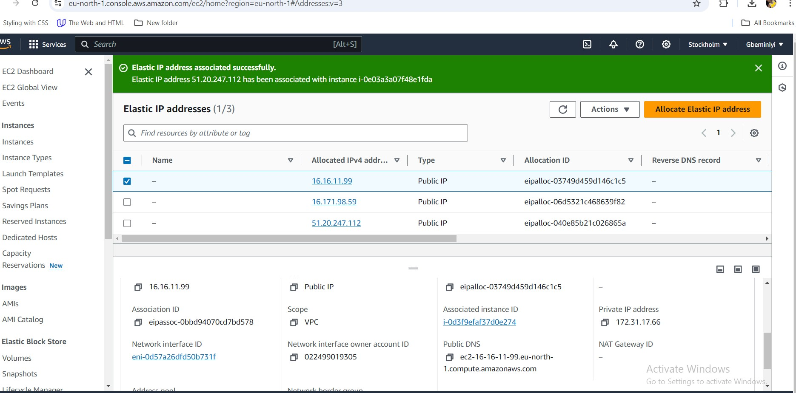
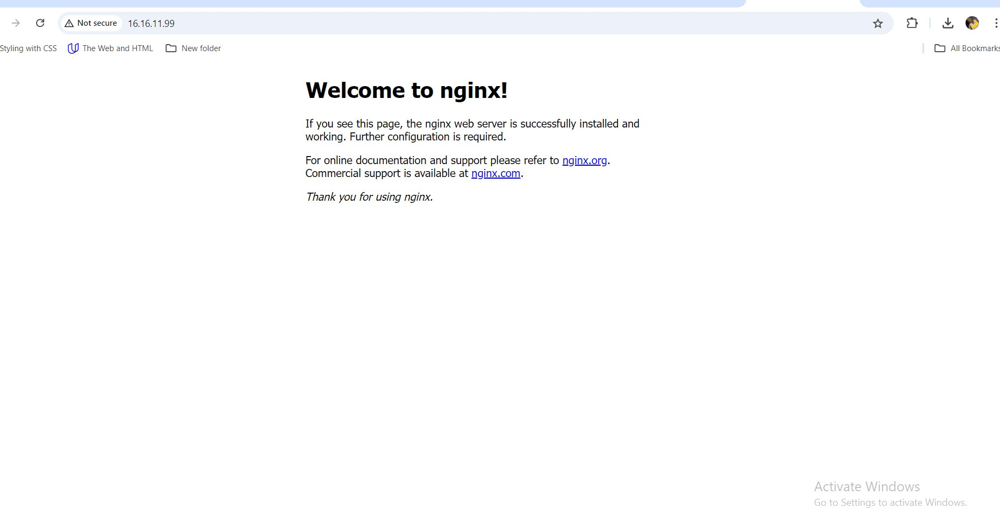
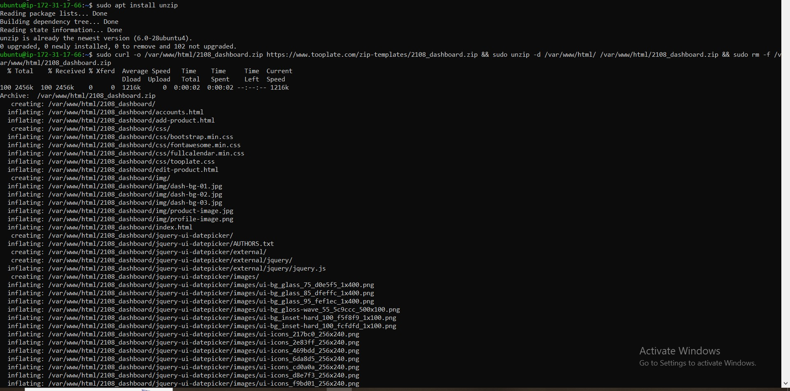
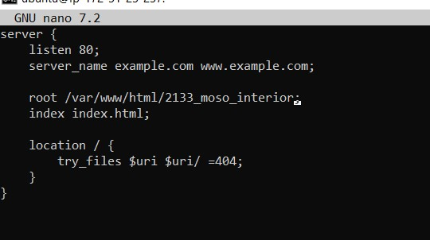
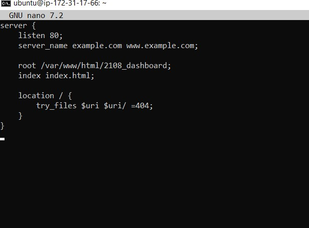
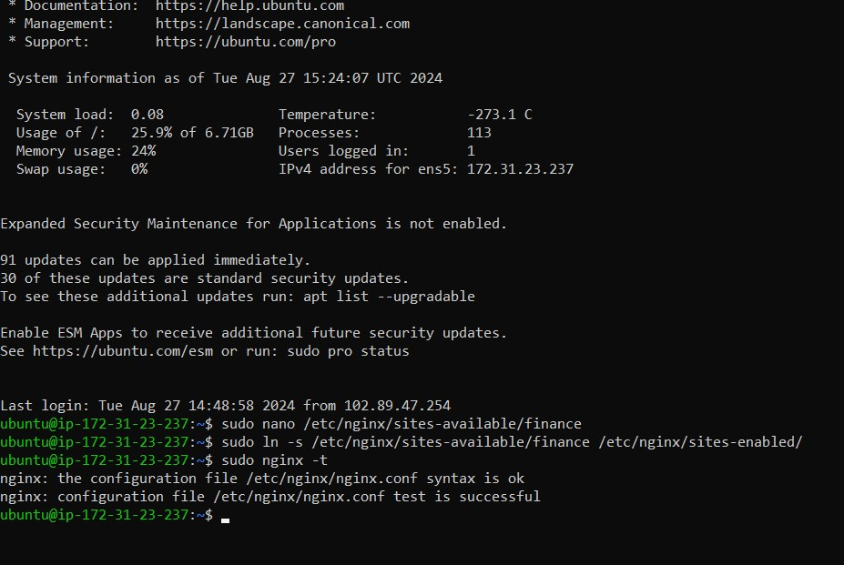
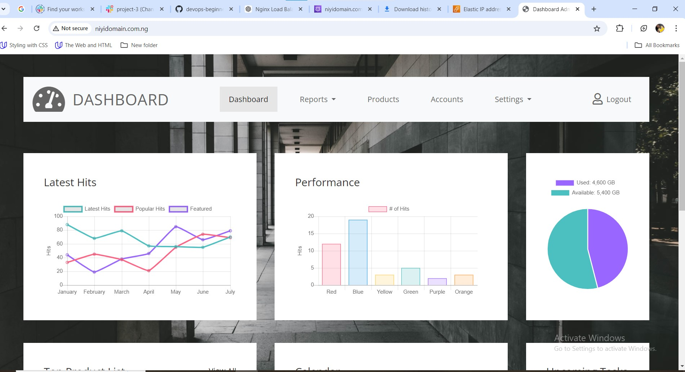
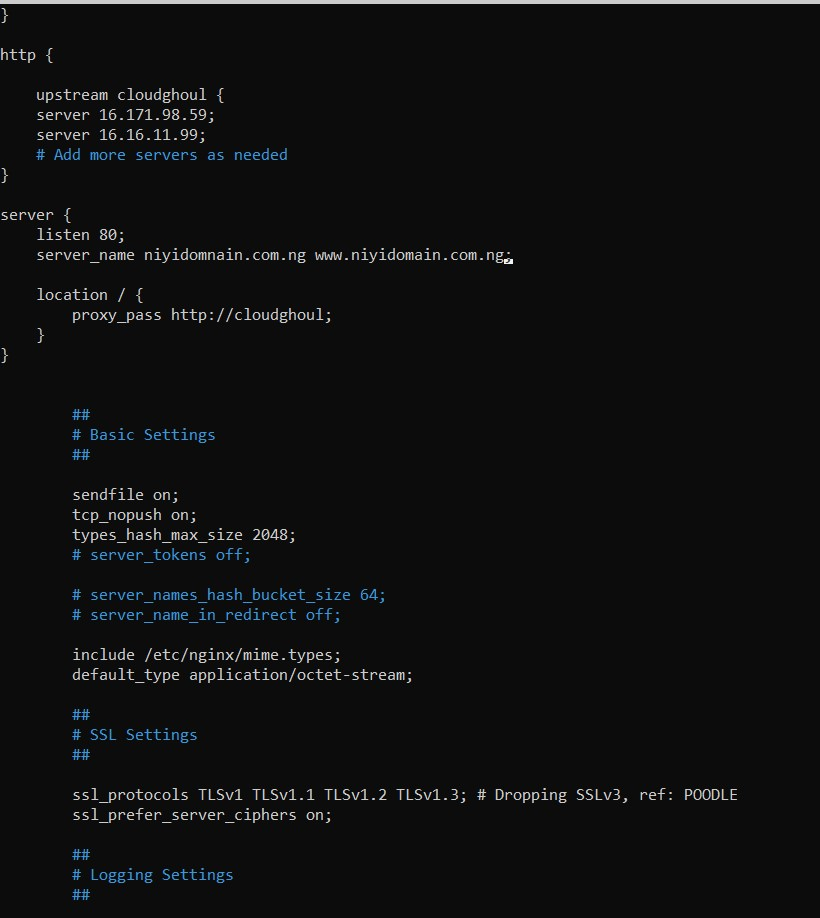
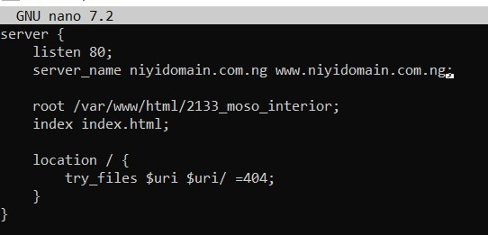
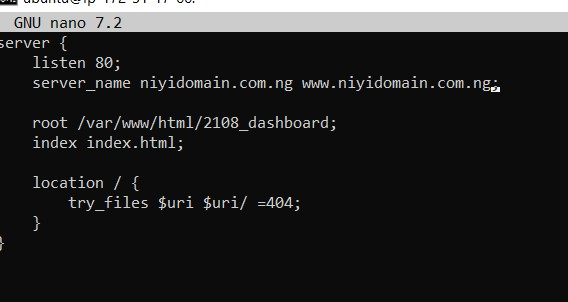

# Project 3: Load Balancing for Static Websites with Nginx

This project involves setting up load balancing for two static websites using Nginx. The project demonstrates how to distribute traffic across multiple web servers and secure the setup with SSL/TLS certificates.

## Step 1: Spin Up Your Servers
1. Launch three Ubuntu servers. Name them appropriately to avoid confusion. Two servers will host the website content, and one will act as the load balancer.




## Step 2: Install Nginx and Set Up Your Websites
1. **Update and Install Nginx**:
    - Run the following commands on each of the two web server terminals:
    ```bash
    sudo apt update
    sudo apt upgrade
    sudo apt install nginx
    ```

    

    - Start Nginx:
    ```bash
    sudo systemctl start nginx
    sudo systemctl enable nginx
    sudo systemctl status nginx
    ```
    - Visit your instance's IP address in a web browser to view the default Nginx startup page.

    

    

2. **Download and Unzip Website Files**:
    - Install the `unzip` tool:
    ```bash
    sudo apt install unzip
    ```
    - Download and unzip the website files:
    ```bash
    sudo curl -o /var/www/html/2135_mini_finance.zip https://www.tooplate.com/zip-templates/2135_moso_interior.zip && sudo unzip -d /var/www/html/ /var/www/html/2133_moso_interior.zip && sudo rm -f /var/www/html/2133_moso_interior.zip
    ```

3. **Set Up the Nginx Configuration for the First Website**:
    - Open the Nginx configuration file for editing:
    ```bash
    sudo nano /etc/nginx/sites-available/finance
    ```

    

    - Copy and paste the following configuration into the file:
    ```nginx
    server {
        listen 80;
        server_name example.com www.example.com;

        root /var/www/html/2133_moso_interior;
        index index.html;

        location / {
            try_files $uri $uri/ =404;
        }
    }
    ```
     

    - Create a symbolic link:
    ```bash
    sudo ln -s /etc/nginx/sites-available/finance /etc/nginx/sites-enabled/
    ```
    - Check the Nginx configuration and restart the service:
    ```bash
    sudo nginx -t
    sudo systemctl restart nginx
    ```
    

4. **Set Up the Second Website**:
    - On the second server, repeat the steps above with a different website template:
    ```bash
    sudo curl -o /var/www/html/2133_moso_interior.zip https://www.tooplate.com/zip-templates/2108_dashboard.zip && sudo unzip -d /var/www/html/ /var/www/html/2108_dashboard.zip && sudo rm -f /var/www/html/2133_dashboard.zip
    ```

    - Open the Nginx configuration file for editing:
    ```bash
    sudo nano /etc/nginx/sites-available/interior
    ```
    - Copy and paste the following configuration into the file:
    ```nginx
    server {
        listen 80;
        server_name placeholder.com www.placeholder.com;

        root /var/www/html/2133_dashboard;
        index index.html;

        location / {
            try_files $uri $uri/ =404;
        }
    }
    ```



    - Create a symbolic link:
    ```bash
    sudo ln -s /etc/nginx/sites-available/interior /etc/nginx/sites-enabled/
    ```


    - Check the Nginx configuration and restart the service:
    ```bash
    sudo nginx -t
    sudo systemctl restart nginx
    ```


5. **Remove Default Configuration**:
    - On both servers, remove the default Nginx configuration:
    ```bash
    sudo rm /etc/nginx/sites-enabled/default
    sudo systemctl restart nginx
    ```

6. **Verify the Websites**:
    - Visit the IP addresses of both servers in a web browser to ensure the websites are up and running.

    

    

## Step 3: Configure the Load Balancer
1. **Install Nginx on the Load Balancer Server**:
    - Update and install Nginx on the load balancer server(51.20.247.112):
    ```bash
    sudo apt update
    sudo apt install nginx
    sudo systemctl start nginx
    sudo systemctl enable nginx
    sudo systemctl status nginx
    ```

2. **Edit the Nginx Configuration**:
    - Open the Nginx configuration file for editing:
    ```bash
    sudo nano /etc/nginx/nginx.conf
    ```
    - Add the following configuration within the `http` block:
    ```nginx
    upstream cloudghoul {
        server <server 1 16.171.98.59>;
        server <server 2 16.16.11.99>;
    }

    server {
        listen 80;
        server_name <niyidomain.com.ng> www.<niyidomain.com.ng>;

        location / {
            proxy_pass http://cloudghoul;
        }
    }
    ```

    

3. **Check and Apply Configuration**:
    - Run the following commands:
    ```bash
    sudo nginx -t
    sudo systemctl restart nginx
    ```
    

## Step 4: Create DNS A Records
1. **Point Your Domain to the Load Balancer**:
    - In AWS Route 53, create an A record for your root domain pointing to the public IP address of the load balancer.
    - Create another A record for the `www` subdomain pointing to the same IP.

    

2. **Update Nginx Server Blocks**:
    - On the first web server, update the Nginx configuration:
    ```bash
    sudo nano /etc/nginx/sites-available/finance
    ```
    - Replace the `server_name` directive with your actual domain:
    ```nginx
    server_name niyidomain.com.ng www.niyidomain.com.ng;
    ```
    - Restart Nginx:
    ```bash
    sudo systemctl restart nginx
    ```
    


    - Repeat the above steps for the second web server.

    


## Step 5: Install Certbot and Request SSL/TLS Certificates
1. **Install Certbot**:
    - On the load balancer server, run the following commands:
    ```bash
    sudo apt update
    sudo apt install python3-certbot-nginx
    ```

2. **Request Certificates**:
    - Run Certbot:
    ```bash
    sudo certbot --nginx
    ```
    - Follow the prompts to select the domain names for which you want to enable HTTPS.

    

3. **Verify HTTPS**:
    - Access your domain in a web browser using `https://` to confirm that SSL/TLS is working.

   

4. **Set Up Automatic Renewal**:
    - Test renewal with:
    ```bash
    sudo certbot renew --dry-run
    ```
