# Project 2: Deploying Multiple Static Websites with Nginx and Certbot

## Overview
In this project, I set up two static websites on a single Ubuntu server using Nginx as the web server. I also configured DNS for both websites and secured them with SSL certificates using Certbot.

## Task 1: Spin Up an Ubuntu Server and Assign an Elastic IP

1. **Launch an EC2 Instance:**
   - Choose **Ubuntu Server 20.04 LTS** as the AMI.
   - Select an instance type (e.g., `t2.micro`).
   - Configure instance details, storage, and security group settings.
   - Launch the instance.

   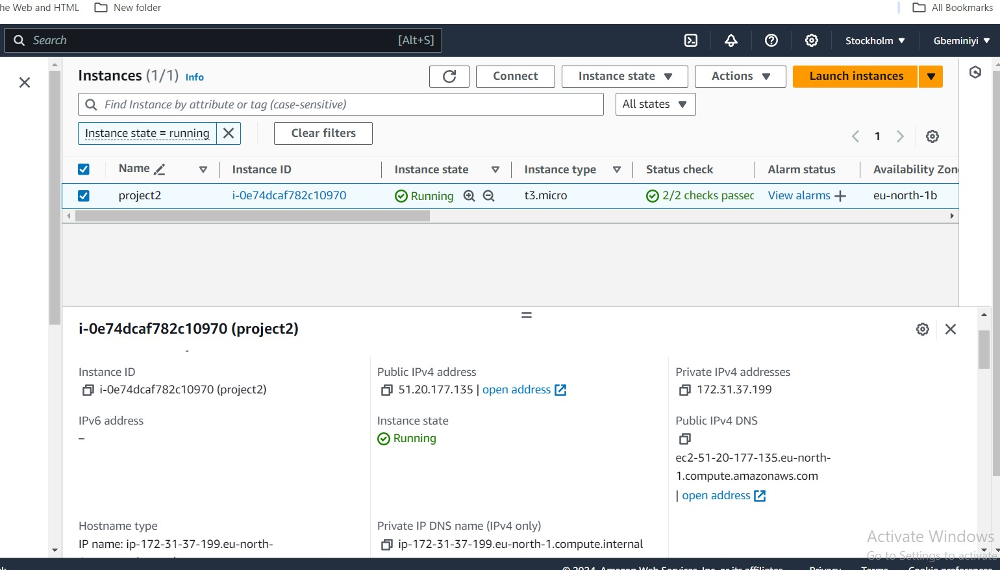


2. **Associate an Elastic IP:**
   - Allocate a new Elastic IP from the AWS console.
   - Associate the Elastic IP with your EC2 instance.

   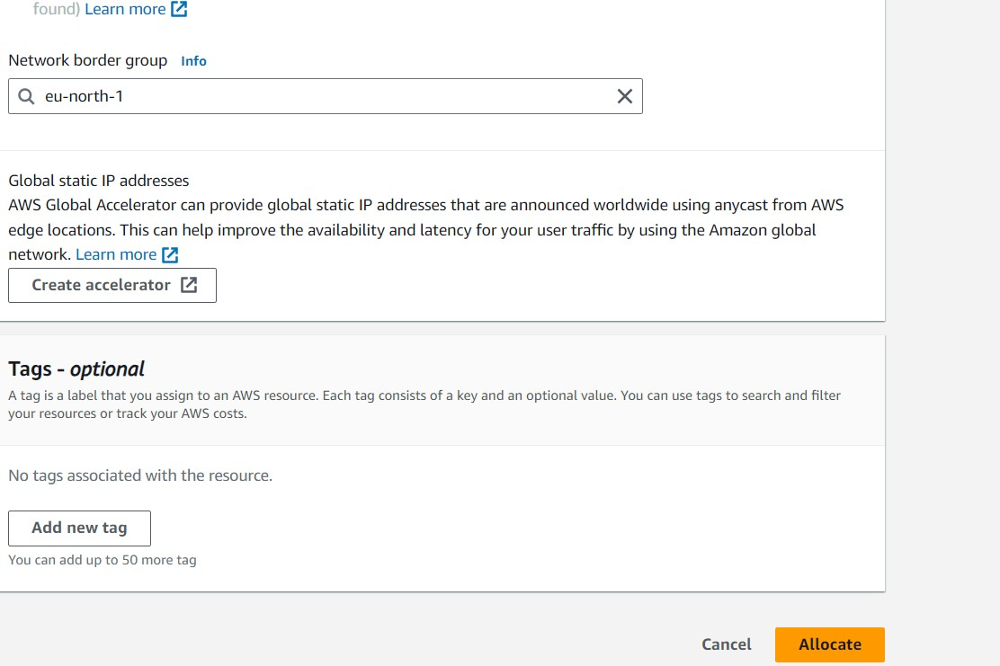

   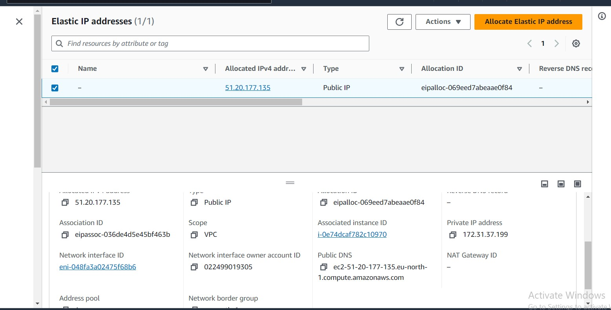

   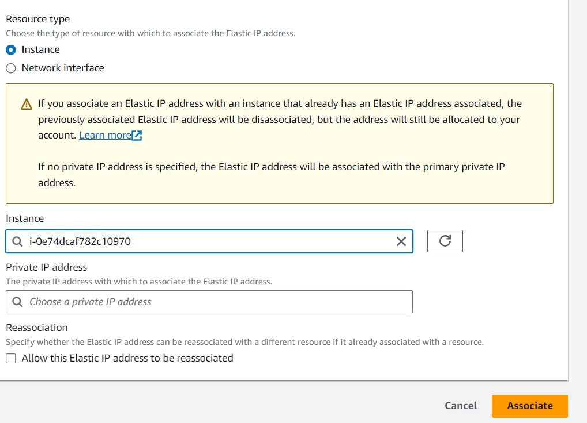

## Task 2: SSH into the Server and Install Nginx

1. **SSH into Your Instance:**
   - Use the command below to connect:
     ```bash
     ssh -i gavi.pem ubuntu@51.20.177.135
     
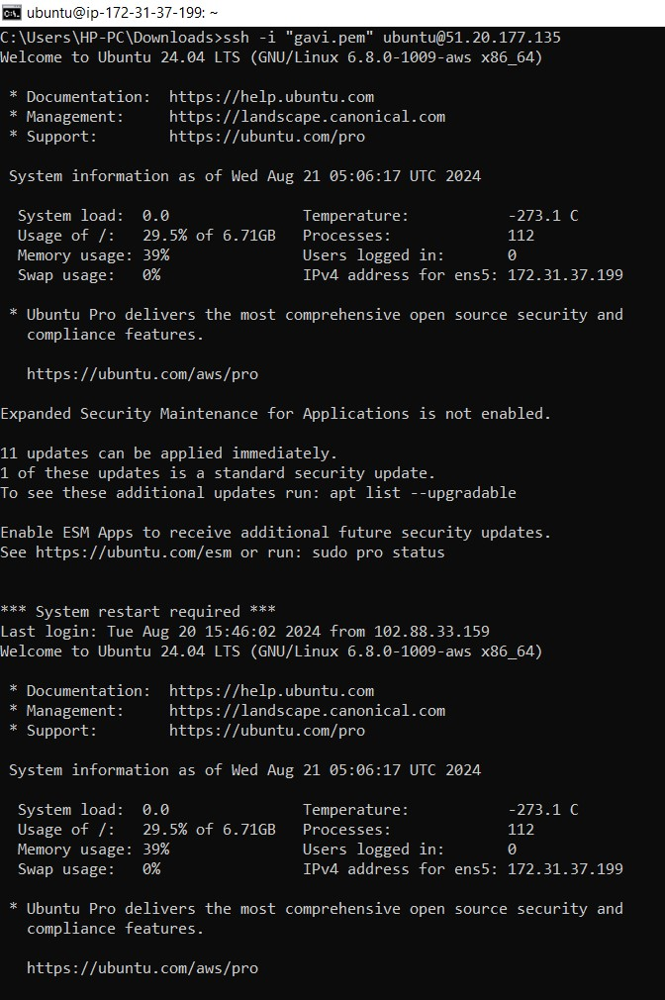

2. **Install Nginx:**
   - Update the package lists and install Nginx:
     ```bash
     sudo apt update
     sudo apt upgrade -y
     sudo apt install nginx -y
     ```

3. **Start and Enable Nginx:**
   - Start Nginx and enable it to start on boot:
     ```bash
     sudo systemctl start nginx
     sudo systemctl enable nginx
     ```
   - Confirm Nginx is running:
     ```bash
     sudo systemctl status nginx
     ```
   - Visit your Elastic IP in a browser to see the Nginx welcome page.

 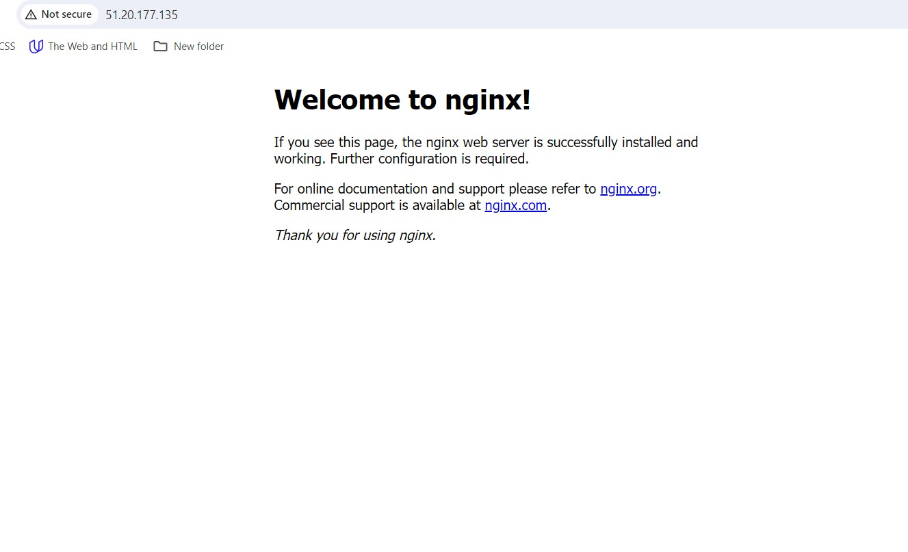

## Task 3: Create Two Website Directories and Download Templates

1. **Download and Unzip the First Website Template:**
   - Download and unzip the first template:
     ```bash
     sudo curl -o /var/www/html/2098_health.zip https://www.tooplate.com/zip-templates/2107_new_spot.zip && sudo unzip -d /var/www/html/ /var/www/html/2107_new_spot.zip && sudo rm -f /var/www/html/2107_new_spot.zip

    
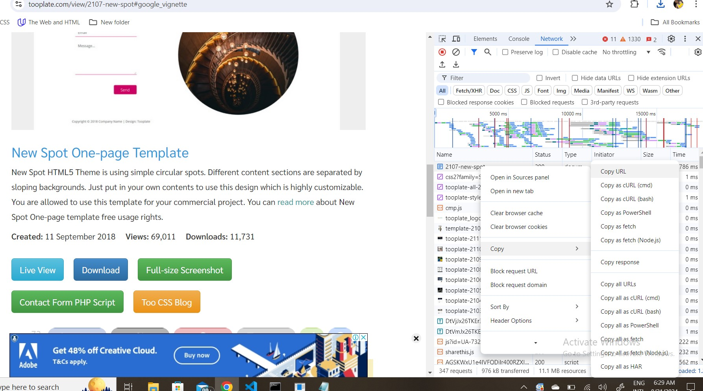

2. **Download and Unzip the Second Website Template:**
   - Download and unzip the second template:
     ```bash
     sudo curl -o /var/www/html/2132_clean_work.zip https://www.tooplate.com/zip-templates/2110_character.zip && sudo unzip -d /var/www/html/ /var/www/html/2110_character.zip && sudo rm -f /var/www/html/2110_character.zip

 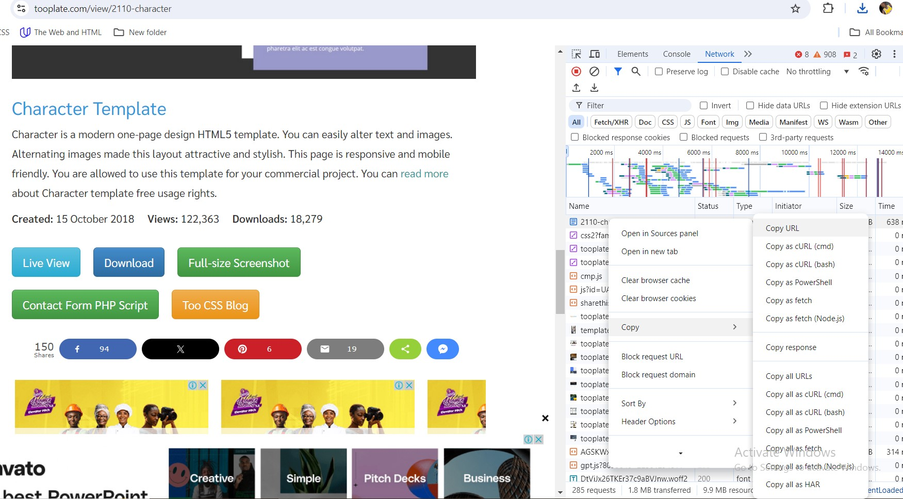

     

## Task 4: Create Two Subdomains

- Navigate to Route 53 in the AWS console.
- Create A records for the root domain and two subdomains.

   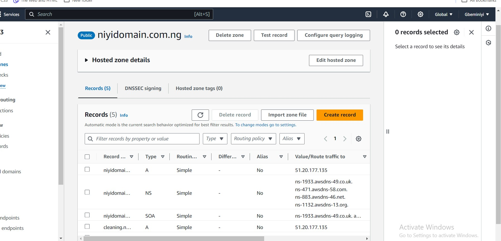

## Task 5: Configure Virtual Hosts for the Two Subdomains

1. **Create Configuration for the First Subdomain:**
   - Open the configuration file for editing:
     ```bash
     sudo nano /etc/nginx/sites-available/health
     ```
   - Add the following configuration:
     ```nginx
     server {
         listen 80;
         server_name health.niyidomain.com.ng;

         root /var/www/html/2107_new_spot;
         index index.html;

         location / {
             try_files $uri $uri/ =404;
         }
     }
     
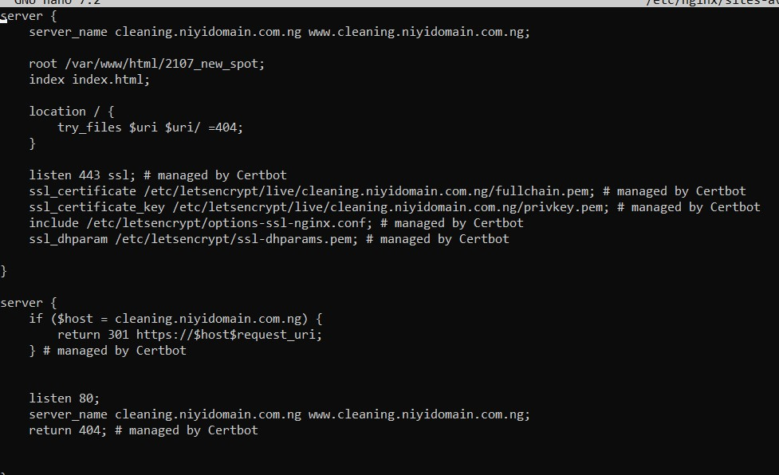
   - Save and exit.

2. **Create Configuration for the Second Subdomain:**
   - Open the configuration file for editing:
     ```bash
     sudo nano /etc/nginx/sites-available/cleaning
     ```
   - Add the following configuration:
     ```nginx
     server {
         listen 80;
         server_name cleaning.niyidomain.com.ng;

         root /var/www/html/2110.character;
         index index.html;

         location / {
             try_files $uri $uri/ =404;
         }
     }
     
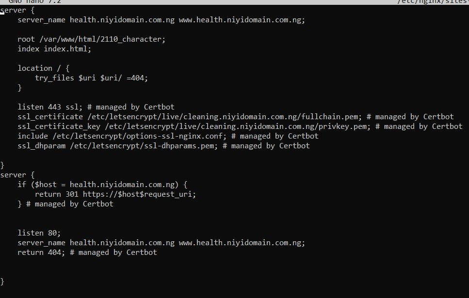
   - Save and exit.

3. **Enable the Sites:**
   - Create symbolic links for both configurations:
     ```bash
     sudo ln -s /etc/nginx/sites-available/health /etc/nginx/sites-enabled/
     sudo ln -s /etc/nginx/sites-available/cleaning /etc/nginx/sites-enabled/
     ```

4. **Remove Default Configuration:**
   - Delete the default files:
     ```bash
     sudo rm /etc/nginx/sites-available/default
     sudo rm /etc/nginx/sites-enabled/default
     ```

5. **Test the Nginx Configuration:**
   - Verify the configuration:
     ```bash
     sudo nginx -t
     ```
   - Restart Nginx:
     ```bash
     sudo systemctl restart nginx
     

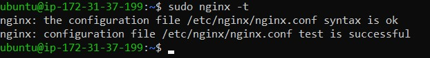

## Task 6: Validate the Setup by Accessing the Subdomains

- Visit `http://health.niyidomain.com.ng` and `http://cleaning.niyidomain.com.ng` in a browser to verify the sites are up.


   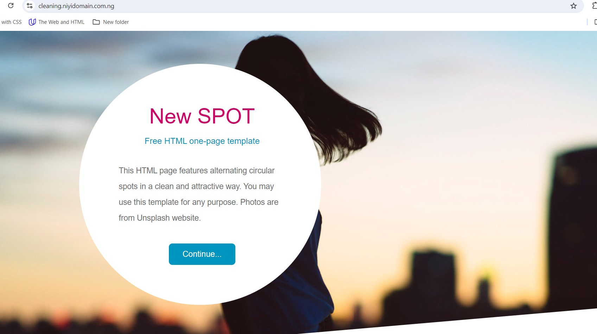

## Task 7: Create a Certbot SSL Certificate for the Root Domain

1. **Install Certbot:**
   - Run the following commands:
     ```bash
     sudo apt update
     sudo apt install python3-certbot-nginx -y
     ```

2. **Request SSL Certificates:**
   - Run Certbot to obtain SSL certificates:
     ```bash
     sudo certbot --nginx
     ```
   - Follow the prompts to select your domain and subdomains for SSL.

   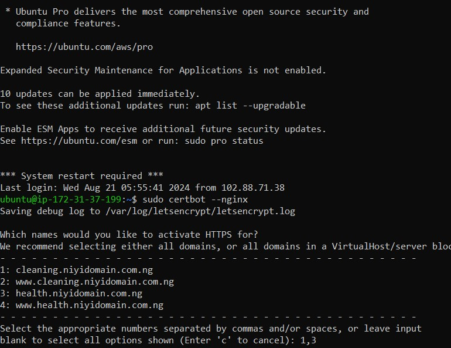

## Task 8: Validate the Subdomains' SSL Using OpenSSL

- Use OpenSSL to validate the SSL certificates:
  ```bash
  openssl s_client -connect health.yourdomain.com:443
  openssl s_client -connect cleaning.yourdomain.com:443

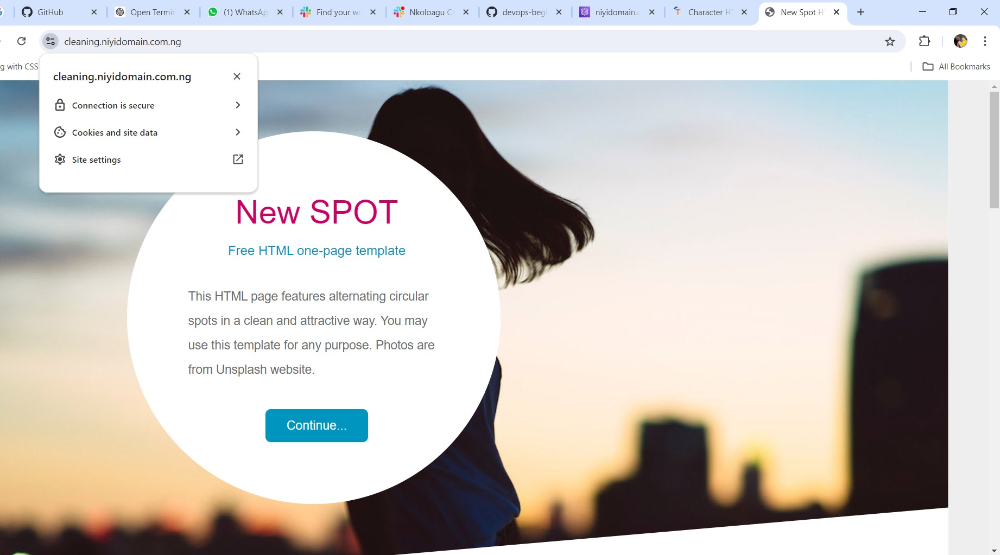
