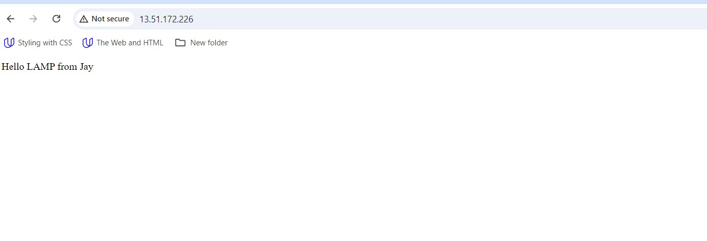

# Setup WordPress Website Using LAMP Stack

## Project 4

## Documentation

Start by deploying an Ubuntu Server.


- Open your **terminal** and connect to your Ubuntu server via SSH.


### Install Apache

- To install Apache, run the following commands in your terminal.

## 2. Installing and Configuring Apache
- Update the package index:
  ```bash
  sudo apt update
  sudo apt install apache2
  sudo ufw allow in "Apache Full"

- To enable Apache to start on boot, execute **`sudo systemctl enable apache2`①**, and then verify its status with the **`sudo systemctl status apache2`②** command.


-  Checking if the server is running and accessible both locally and from the Internet by executing the following command: **`curl http://localhost:80`**.


*Now, it's time to test how our Apache HTTP server responds to requests from the Internet.*

**Opening up a web browser then accessing the following URL: **`http://<13.51.172.226>:80`**


---

### Install MYSQL

- To install this software using 'apt', run the command **`sudo apt install mysql-server`**. When prompted, confirm the installation by typing 'Y' and then pressing ENTER.


- After the installation is complete, log in to the MySQL console by typing: **`sudo mysql`**.

- Run the following command to set the password for the root user with the MySQL native password authentication method: **`ALTER USER 'root'@'localhost' IDENTIFIED WITH mysql_native_password BY 'pass';`**. Exit the MySQL shell when you're done by typing **`exit`**.


- Start the interactive script by running: **`sudo mysql_secure_installation`①**. Answer **y**② for yes, or any other key to continue without enabling specific options.


## Enable MySQL to start on boot by executing **`sudo systemctl enable mysql`①**, and then confirm its status with the **`sudo systemctl status mysql`②** command.


---

### Install PHP

- Install PHP along with required extensions by running the following script: **`sudo apt install php-curl php-gd php-mbstring php-xml php-xmlrpc php-soap php-intl php-zip`**.


**`sudo apt install php libapache2-mod-php php-mysql`**


- Checking the PHP version by running **`php -v`**.


### Creating A Virtual Host For Your Website Using Apache

- Create the directory for Projectlamp using the 'mkdir' command as follows:
**`sudo mkdir /var/www/projectlamp`①** and assign ownership of the directory to our current system user using:
**`sudo chown -R $USER:$USER /var/www/projectlamp`②**.


- Create and open a new configuration file in Apache's sites-available directory using your preferred command-line editor:
**`sudo vi /etc/apache2/sites-available/projectlamp.conf`**.

- Creating this will produce a new blank file. Paste the configuration text provided below into it:

```
<VirtualHost *:80>

ServerName projectlamp

ServerAlias www.projectlamp

ServerAdmin webmaster@localhost

DocumentRoot /var/www/projectlamp

ErrorLog ${APACHE_LOG_DIR}/error.log

CustomLog ${APACHE_LOG_DIR}/access.log combined

</VirtualHost>
```


- Save your changes by pressing the **`Esc`** key, then type **`:wq`** and press **`Enter`**.
- Run the ls command **`sudo ls /etc/apache2/sites-available`①** to show the **new file②** in the sites-available directory.


- We can now enable the new virtual host using the a2ensite command: **`sudo a2ensite projectlamp`**.
- To disable Apache's default website, use the a2dissite command. Type: **`sudo a2dissite 000-default`**.
- To ensure your configuration file doesn’t contain syntax errors, run: **`sudo apache2ctl configtest`**. You should see **"Syntax OK"** in the output if your configuration is correct.


- Finally run: **`sudo systemctl reload apache2`**. This will reload Apache for the changes to take effect.

> [!NOTE]
Our new website is now active, but the web root **`/var/www/projectlamp`** is still empty. Let's create an **`index.html`** file in that location to test that the virtual host works as expected.

- To create the **index.html** file with the content **"Hello LAMP from Jay"** in the /var/www/projectlamp directory, use the following command: **`sudo echo 'Hello LAMP from Jay' > /var/www/projectlamp/index.html`**.

- Remove the index.html file by running the following command: **`sudo rm /var/www/projectlamp/index.html `**
- Now, let's open our web browser and try to access our website using the IP address:

**`http://<13.51.172.226>:80`**




### Enable PHP On The Website

With the default DirectoryIndex settings on Apache, a file named index.html will always take precedence over an index.php file. To change the precedence of index files (such as index.php over index.html) in Apache, you'll need to edit the dir.conf file. Here’s how you can do it:

- Edit the dir.conf file using a text editor (such as nano or vi): **`sudo nano /etc/apache2/mods-enabled/dir.conf`**

- Look for the DirectoryIndex directive within this file. It typically looks like this:

- Press **`ctrl` + `x`①** on your keyboard to save and exit.


- Press **`ctrl` + `x`①** on your keyboard to save and exit.

- Type **`y`②** to save the changes.

- When prompted to confirm the file name, simply press **`ENTER`③** to save the changes with the existing file name.

- Finally, reload Apache for the changes to take effect: **`sudo systemctl reload apache2`**.


Now, Apache will prioritize index.php over index.html when both files exist in the same directory.


**To create a new file named index.php inside your custom web root folder (/var/www/projectlamp), you can use the following command to open it in the nano text editor: **`nano /var/www/projectlamp/index.php`**.

- This will create a new file. Copy and paste the following PHP code into the new file:

```
<?php

phpinfo();
```


- Once you've saved and closed the file, go back to your web browser and refresh the page. You should see something like this:


> [!NOTE]
- It's recommended to remove the file you created, as it contains sensitive information about your PHP environment and your Ubuntu server. You can use the rm command to do so:
**`sudo rm /var/www/projectlamp/index.php`**..

---

### Install Wordpress

- Navigate to the directory using the cd command **`cd /var/www/html`**, and then download the WordPress installation files using the following command: **`sudo wget -c http://wordpress.org/latest.tar.gz`**


- Extract the files from the downloaded WordPress archive using the command: **`sudo tar -xzvf latest.tar.gz`**


- Check the user running your web server with the command: **`ps aux | grep apache | grep -v grep`**.


*This command filters processes related to Apache (apache2 on Ubuntu) and displays information about the user running those processes.*

- Grant ownership of the WordPress directory and its files to the web server user by running the command: **`sudo chown -R www-data:www-data /var/www/html/wordpress`**.


### Create a Database For Wordpress

- Access your MySQL root account with the following command: **`sudo mysql -u root -p`①**. Enter the **password②** you set earlier when prompted.


- To create a separate database named wp_db for WordPress to manage, execute the following command in the MySQL prompt: **`CREATE DATABASE wp_db;`**


- To access the new database, you can create a MySQL user account with a strong password using the following command:
**`CREATE USER jay@localhost IDENTIFIED BY 'wp-password';`**


- To grant your created user (jay@localhost) all privileges needed to work with the wp_db database in MySQL, use the following commands:

```
GRANT ALL PRIVILEGES ON wp_db.* TO jay@localhost;
FLUSH PRIVILEGES;
```


- Type **`exit`** to exit the MySQL shell.

- Grant executable permissions recursively (-R) to the wordpress folder using the following command: **`sudo chmod -R 777 wordpress/`**

- Change into the WordPress directory by running the command: **`cd wordpress`**.

### Configure Wordpress

Once you've established a database for WordPress, the next crucial step is setting up and configuring WordPress itself. To begin, you'll need to create a configuration file tailored for WordPress.

- Rename the sample WordPress configuration file with the command: **`mv wp-config-sample.php wp-config.php`**.

- Edit the **`wp-config.php`** file using the command: **`sudo nano wp-config.php`**.

- Update the database settings in the **`wp-config.php`** file by replacing placeholders like **database_name_here**, **username_here**, and **password_here** with your actual database details.

- Modify the configuration file projectlamp.conf: **`sudo nano /etc/apache2/sites-available/projectlamp.conf`** to update the document root to the directory where your WordPress installation is located.


- After updating the document root to **`/var/www/html`** directory in your editor, save the changes and exit.


- Reload Apache for the changes to take effect: **`sudo systemctl reload apache2`**.

- Access the WordPress page to complete the installation. Using  **`http://<13.51.172.226>/wordpress/`**.


- Enter the required information and click on **Install WordPress** once you have finished.


- WordPress has been successfully installed. You can now log in to your admin dashboard using the previously set up information by clicking the **Log In** button.

- Once you successfully log in, you will be greeted by the WordPress dashboard page.


---

### Create An A Record

To make the website accessible via my domain name rather than the IP address, I set up a DNS record by moving hosting to AWS Route 53, where I set up an A record.

- Point your domain's DNS records to the IP addresses of your Apache load balancer server.

- In route 53, click on **Create record**.

- Paste your **IP address➀** and then click on **Create records➁** to create the root domain.


- Click on **Create record** again, to create the record for your sub domain.

- Paste the same IP address➀, input the Record name(**www➁**) and then click on **Create records**➂.


- Update your Apache configuration file in the sites-available directory to point to your domain name, use the command: **`sudo nano /etc/apache2/sites-available/projectlamp.conf`**.

```
<VirtualHost *:80>
    ServerName <niyidomain.com.ng>
    ServerAlias <www.niyidomain.com.ng>
    ServerAdmin webmaster@<niyidomain.com.ng>

    DocumentRoot /var/www/html/wordpress

    <Directory /var/www/html/wordpress>
        Options Indexes FollowSymLinks
       # AllowOverride All
        Require all granted
    </Directory>

    ErrorLog ${APACHE_LOG_DIR}/error.log
    CustomLog ${APACHE_LOG_DIR}/access.log combined
</VirtualHost>
```


- To update your **`wp-config.php`** file with DNS settings, use the following command: **`sudo nano wp-config.php`** and add these lines to the file:
```

/** MY DNS SETTINGS */
define('WP_HOME', 'http://<niyidomain.com.ng>');

define('WP_SITEURL', 'http://<niyidomain.com.ng>');
```


- Reload your Apache server to apply the changes with the command: **`sudo systemctl reload apache2`**, After reloading, visit your website at **`http://<niyi.com.ng>`** to view your WordPress site.


- To log in to your WordPress admin portal, visit **`http://<niyidomain.com.ng>/wp-admin`**, Enter your **username①** and **password②**, then click on **log In③**.

> [!NOTE]
My domain name is **niyidomain.com.ng**, so i'll visit **`http://niyidomain.com.ng/wp-admin`**.

- Now that your WordPress site is successfully configured to use your domain name, the next step is to secure it by requesting an SSL/TLS certificate.


---

### Install certbot and Request For an SSL/TLS Certificate

- Install certbot by executing the following commands:
`sudo apt update`
`sudo apt install certbot python3-certbot-apache`

- Run the command **`sudo certbot --apache`** to request your SSL/TLS certificate. Follow the instructions provided by Certbot to select the domain name for which you want to enable HTTPS.

- You should receive a message confirming that the certificate has been successfully obtained.


- Visit your website to confirm, and you'll notice that the **"not secure"** warning no longer appears, indicating that your site is now secure with HTTPS.

---
---


#### The End Of Project 4